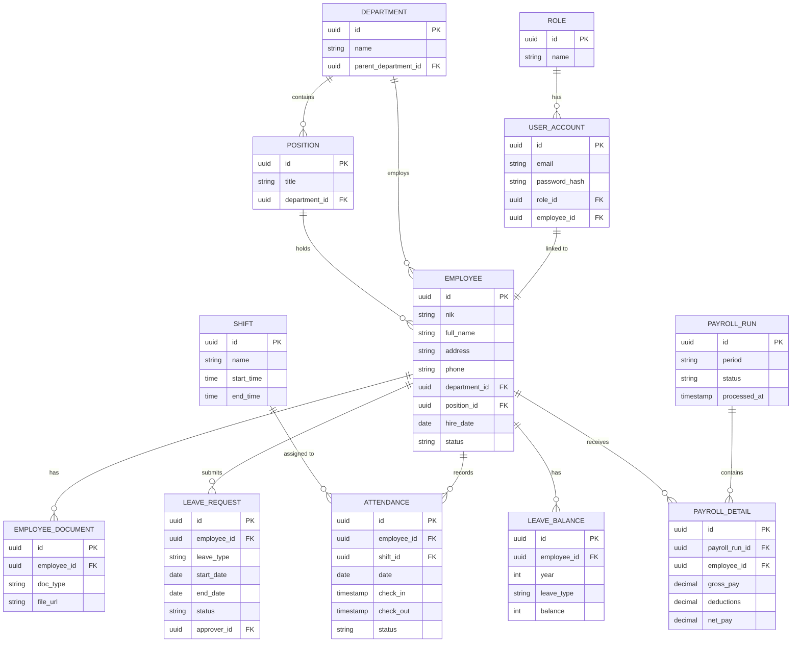
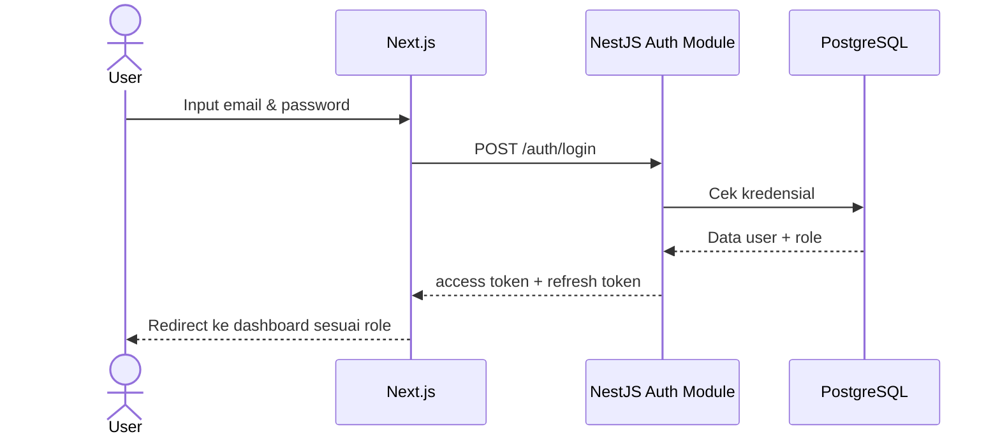
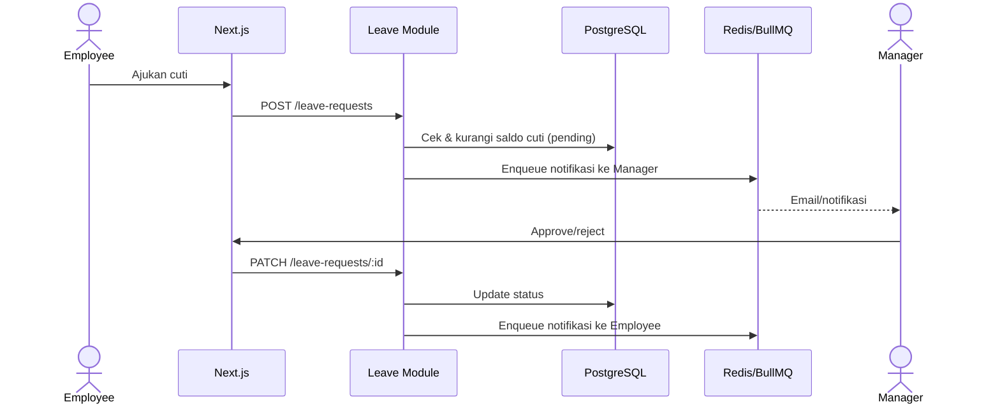
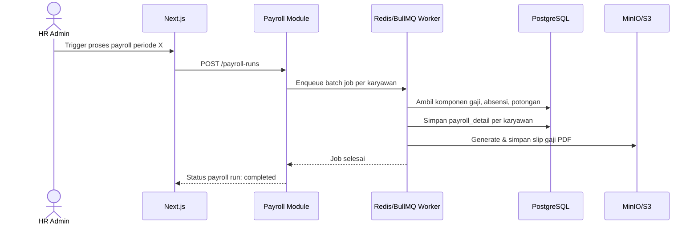

# Software Design Document (SDD)
# Sistem Informasi HRIS Modern

**Versi**: 0.1 (Draft)
**Tanggal**: 3 September 2026
**Status**: Draft
**Referensi**: SRS-HRIS.md v0.1

---

## 1. Pendahuluan

### 1.1 Tujuan
Dokumen ini menjelaskan desain teknis sistem HRIS modern: arsitektur, desain database, desain modul, desain API, desain keamanan, dan desain deployment — sebagai turunan dari kebutuhan yang tercantum di SRS-HRIS.md.

### 1.2 Ruang Lingkup
Mencakup desain untuk modul: Autentikasi, Manajemen Karyawan, Absensi, Cuti/Izin, Penggajian, dan Pelaporan. Modul Rekrutmen dan Penilaian Kinerja (fase lanjutan) belum didetailkan di sini.

---

## 2. Arsitektur Sistem

### 2.1 Gambaran Arsitektur
Sistem menggunakan arsitektur 3 lapis (client-server, REST API):

```
Web & mobile client (Next.js)
            |
            v
   API server (NestJS)
       Auth & business logic
      /        |          \
     v         v           v
PostgreSQL   Redis     MinIO / S3
(data)    (cache/queue) (files)
```

- **Client layer**: Next.js — merender UI, memanggil REST API
- **Application layer**: NestJS — menangani auth, validasi, business logic, terbagi per modul (module pattern NestJS: `AuthModule`, `EmployeeModule`, `AttendanceModule`, `LeaveModule`, `PayrollModule`, `ReportModule`)
- **Data layer**: PostgreSQL untuk data transaksional, Redis untuk cache & job queue (BullMQ), MinIO/S3 untuk dokumen & file

### 2.2 Komponen Utama

| Komponen | Tanggung Jawab |
|---|---|
| Auth Module | Login, JWT, refresh token, RBAC guard |
| Employee Module | CRUD data karyawan, struktur organisasi, dokumen |
| Attendance Module | Pencatatan absensi, kalkulasi lembur/telat |
| Leave Module | Pengajuan cuti, approval, saldo cuti |
| Payroll Module | Kalkulasi gaji, generate slip, batch processing |
| Report Module | Agregasi data untuk laporan & dashboard |
| Notification Worker | Job async (email/notifikasi) via BullMQ + Redis |

### 2.3 Teknologi

| Layer | Teknologi |
|---|---|
| Frontend | Next.js (React), Ant Design |
| Backend | NestJS (Node.js, TypeScript) |
| Database | PostgreSQL |
| Cache / Queue | Redis + BullMQ |
| File storage | MinIO (S3-compatible) |
| Autentikasi | JWT (access + refresh token) |
| Containerization | Docker, Docker Compose |
| CI/CD | GitHub Actions |

---

## 3. Desain Database

### 3.1 Entity Relationship Diagram



### 3.2 Deskripsi Entitas Utama

| Entitas | Deskripsi |
|---|---|
| `USER_ACCOUNT` | Kredensial login, terhubung 1:1 ke `EMPLOYEE` |
| `EMPLOYEE` | Data induk karyawan |
| `DEPARTMENT` / `POSITION` | Struktur organisasi |
| `ATTENDANCE` | Catatan absensi harian |
| `LEAVE_REQUEST` / `LEAVE_BALANCE` | Pengajuan dan saldo cuti |
| `PAYROLL_RUN` / `PAYROLL_DETAIL` | Batch payroll per periode dan rincian per karyawan |

---

## 4. Desain Modul (Alur Utama)

### 4.1 Alur Login & Autentikasi



### 4.2 Alur Pengajuan & Approval Cuti



### 4.3 Alur Proses Payroll Bulanan



---

## 5. Desain API

### 5.1 Konvensi
- REST API, format JSON
- Autentikasi: `Authorization: Bearer <access_token>`
- Prefix versi: `/api/v1`

### 5.2 Daftar Endpoint (Ringkasan)

| Method | Endpoint | Deskripsi | Role |
|---|---|---|---|
| POST | `/api/v1/auth/login` | Login | Semua |
| POST | `/api/v1/auth/refresh` | Refresh token | Semua |
| GET | `/api/v1/employees` | List karyawan | HR Admin, Manager |
| POST | `/api/v1/employees` | Tambah karyawan | HR Admin |
| GET | `/api/v1/employees/:id` | Detail karyawan | HR Admin, Employee (diri sendiri) |
| POST | `/api/v1/attendance/check-in` | Absen masuk | Employee |
| POST | `/api/v1/attendance/check-out` | Absen keluar | Employee |
| GET | `/api/v1/attendance/team` | Rekap absensi tim | Manager |
| POST | `/api/v1/leave-requests` | Ajukan cuti | Employee |
| PATCH | `/api/v1/leave-requests/:id` | Approve/reject cuti | Manager |
| GET | `/api/v1/leave-balances/:employeeId` | Cek saldo cuti | Employee, HR Admin |
| POST | `/api/v1/payroll-runs` | Trigger proses payroll | HR Admin |
| GET | `/api/v1/payroll-runs/:id` | Status payroll run | HR Admin |
| GET | `/api/v1/payslips/:employeeId` | Lihat/unduh slip gaji | Employee |
| GET | `/api/v1/reports/summary` | Dashboard ringkasan SDM | HR Admin, Manager |

---

## 6. Desain Keamanan

### 6.1 Autentikasi & Otorisasi
- JWT access token (short-lived, ± 15 menit) + refresh token (long-lived, disimpan di HTTP-only cookie)
- Guard di NestJS (`@UseGuards(JwtAuthGuard, RolesGuard)`) untuk validasi token & role di setiap endpoint

### 6.2 RBAC Matrix (Ringkasan)

| Modul | Employee | Manager | HR Admin | Superadmin |
|---|---|---|---|---|
| Data diri | Read/Update terbatas | - | Full | Full |
| Data tim | - | Read | Full | Full |
| Absensi | Create (diri sendiri) | Read (tim) | Full | Full |
| Cuti | Create/Read (diri sendiri) | Approve (tim) | Full | Full |
| Payroll | Read slip (diri sendiri) | - | Full | Full |
| Konfigurasi akses | - | - | - | Full |

### 6.3 Keamanan Data
- Password disimpan dengan hashing (bcrypt/argon2)
- Data sensitif (NIK, data payroll) dienkripsi at-rest di database
- Koneksi API wajib HTTPS/TLS

---

## 7. Desain Deployment

### 7.1 Arsitektur Deployment (Docker Compose)

Services: `frontend` (Next.js), `backend` (NestJS), `postgres`, `redis`, `minio`, masing-masing container terpisah dalam satu Docker network, di-orchestrate lewat `docker-compose.yml` untuk lingkungan development.

### 7.2 Environment
| Environment | Tujuan |
|---|---|
| Development | Lokal, docker-compose |
| Staging | Testing sebelum rilis |
| Production | Live, idealnya dengan managed Postgres/Redis |

### 7.3 CI/CD
GitHub Actions: lint & test otomatis saat push/PR → build image Docker → deploy ke staging/production.

---

## 8. Lampiran

### 8.1 Daftar Singkatan
Mengikuti daftar istilah di SRS-HRIS.md.

### 8.2 Catatan Versi
Dokumen ini draft awal. Detail sequence diagram akan bertambah seiring modul Rekrutmen dan Penilaian Kinerja mulai didesain.
